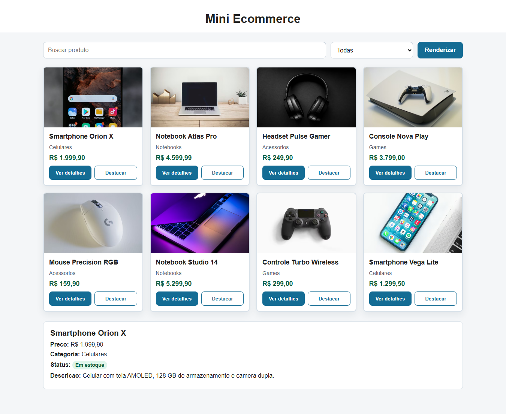
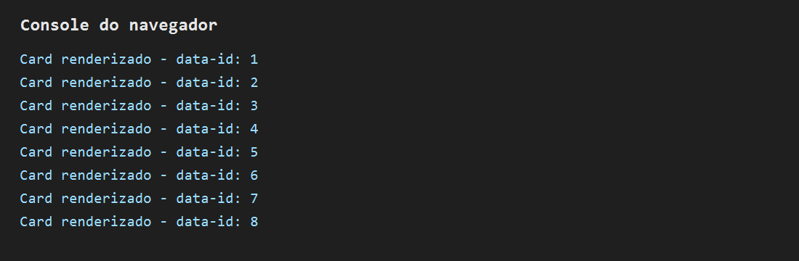

# Mini Ecommerce - Catalogo em Cards

Aluno: Mateus Andrade  
Matricula: 1809

## Descricao

Atividade pratica da semana 9 com manipulacao do DOM em JavaScript. A pagina renderiza cards de produtos, permite busca por texto, filtro por categoria, visualizacao de detalhes e destaque visual dos cards.

## Funcionalidades

- Renderizacao de pelo menos 8 produtos em cards.
- Select de categorias preenchido dinamicamente.
- Busca por texto no nome do produto.
- Filtro por categoria.
- Botao "Ver detalhes" exibindo nome, preco, categoria, estoque e descricao.
- Botao "Destacar" alterando o visual do card.
- Uso de `getElementById`, `querySelector`, `querySelectorAll`, `innerHTML`, `createElement`, `setAttribute`, `appendChild`, `classList.add`, `style` e `addEventListener`.

## Prints

Print da tela com os cards renderizados e a area de detalhes preenchida depois de clicar em "Ver detalhes".

Print do Console do navegador mostrando a saida dos `data-id` gerada com `querySelectorAll`.

## Como executar

Abra o arquivo `index.html` no navegador.
